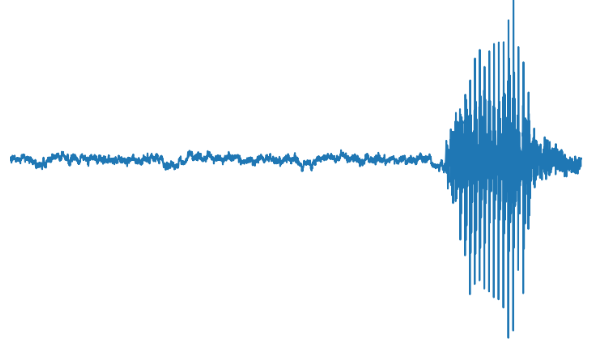

***EN***

# Project

The project aims to develop a comprehensive system for extracting, standardizing, and identifying audio files. Initially, the process verifies the folder where the files will be extracted and ensures that each file exists before attempting to open it. Next, it decompresses .gz files into .tar files, extracts the contents of the .tar, and retrieves the paths to the audio files. During this step, all .wav files are selected and the folder names are used as labels, which facilitates data identification. A specific function is then called to extract and list the files, displaying the first files found for validation.

After extraction, the focus shifts to standardizing the audio files, ensuring that all files follow a consistent format for submission and processing. Each audio file is loaded and processed to meet a standard format: the audio is decoded into mono, unnecessary dimensions are removed, and the audio is resampled to 16 kHz if the original sampling rate differs. Additionally, the audio length is adjusted—long audio files are truncated while shorter ones are padded with zeros. This preprocessing step enables waveform plotting and the application of techniques such as sfft for spectrogram analysis, contributing to a better understanding of the audio signals.

The next phase involves training an audio identification model. In this process, a neural network architecture is built that includes specific layers, among which is a channel attention layer. This layer is responsible for correctly adjusting dimensions, expanding inputs, and applying the necessary attention to highlight relevant features of the data. During training, historical summaries of accuracy and loss are plotted, allowing for performance evaluation of the model. The results demonstrated an accuracy above 0.7, indicating that with additional training and adjustments—such as improvements using spectrograms—the performance could be enhanced even further.

Finally, the trained model is saved and configured as a pre-trained model capable of classifying over 500 audio categories, showcasing the robustness and applicability of the developed system.

---
***PT-BR***

# Projeto

O projeto tem como objetivo desenvolver um sistema completo para extração, padronização e identificação de arquivos de áudio. Inicialmente, o processo verifica a pasta onde os arquivos serão extraídos, certificando-se de que cada arquivo existe antes de ser aberto. Em seguida, realiza a descompactação de arquivos no formato .gz para .tar, extraindo o conteúdo deste último para obter os caminhos dos arquivos de áudio. Durante essa etapa, são selecionados todos os arquivos .wav e os nomes das pastas são utilizados como rótulos, possibilitando a identificação dos dados. Uma função específica é chamada para extrair e listar os arquivos, exibindo os primeiros arquivos encontrados para validação.

Após a extração, o foco se volta para a padronização dos arquivos de áudio, garantindo que todos sigam um formato consistente para envio e processamento. Cada arquivo de áudio é carregado e processado para atender a um formato padrão: o áudio é decodificado em mono, dimensões desnecessárias são removidas, e o áudio é reamostrado para 16 kHz caso a taxa original seja diferente. Além disso, o tamanho do áudio é ajustado—áudios muito longos são truncados, enquanto os curtos recebem preenchimento com zeros. Esse pré-processamento possibilita a plotagem da forma de onda e a aplicação de técnicas como a sfft para análise dos espectrogramas, contribuindo para uma melhor compreensão dos sinais de áudio.

A etapa seguinte envolve o treinamento de um modelo de identificação de áudio. Neste processo, é construída uma arquitetura de rede neural que inclui a criação de camadas específicas, entre elas uma camada de atenção de canal. Essa camada é responsável por ajustar corretamente as dimensões, expandir as entradas e aplicar a atenção necessária para realçar as características relevantes dos dados. Durante o treinamento, são gerados resumos históricos da precisão e da perda, permitindo avaliar o desempenho do modelo. Os resultados demonstraram uma acurácia acima de 0,7, indicando que, com treinamentos adicionais e ajustes—como a melhoria através dos spectrogramas—o desempenho pode ser ainda maior.

Por fim, o modelo treinado é salvo e configurado como um modelo pré-treinado, capaz de classificar mais de 500 categorias de áudio, o que evidencia a robustez e a aplicabilidade do sistema desenvolvido.

